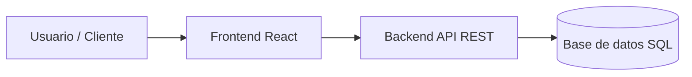

# Sistema de Gestión de Biblioteca 📚


Aplicación web para la gestión, reserva y préstamo de libros en bibliotecas universitarias. Permite administrar el catálogo en tiempo real, controlar préstamos a estudiantes y gestionar alertas de devolución.

---

## Tabla de contenidos

- [Descripción](#descripción)
- [Instalación](#instalación)
- [Uso](#uso)
- [Estado de funcionalidades](#estado-de-funcionalidades)
- [Pendientes](#pendientes)
- [Arquitectura](#arquitectura)
- [Contribuidores](#contribuidores)

---

## Descripción

Este sistema busca digitalizar el inventario de libros y automatizar el registro de préstamos, facilitando la consulta rápida para alumnos y docentes.

---

## Instalación

```bash
# Clonar el repositorio
git clone https://github.com/royercondori-lgtm/laboratorio-readme.git https://github.com/royercondori-lgtm/laboratorio-readme.git

# Entrar a la carpeta
cd laboratorio-readme

# Instalar dependencias
npm install
```

---

## Uso

```bash
# Ejecutar el proyecto en modo desarrollo
npm start
```

## Estado de funcionalidades

| Módulo            | Descripción                        | Estado      |
| :---------------- | :--------------------------------- | :---------- |
| **Autenticación** | Login y registro de usuarios       | Listo       |
| **Catálogo**      | Búsqueda y filtro de libros        | Listo       |
| **Préstamos**     | Registro de salidas y devoluciones | En progreso |
| **Reportes**      | Generación de reportes en PDF      | Pendiente   |

---

## Pendientes

- [x] Configuración inicial del proyecto
- [x] Creación del modelo de base de datos
- [ ] Implementar autenticación con JWT
- [ ] Diseñar vista para la búsqueda de libros

---

## Arquitectura



## Contribuidores

- **Royer Condori** - [@royercondori-lgtm](https://github.com/royercondori-lgtm)
